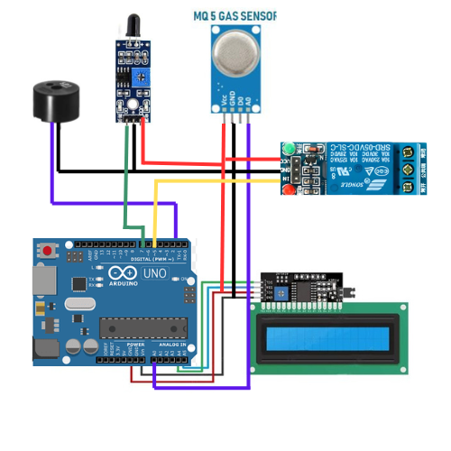

# Project Report: Kitchen Safety System
# 1. Introduction

The Kitchen Safety System is designed to enhance kitchen safety by detecting gas leaks and fire, and providing timely alerts and responses. The system aims to minimize the risk of fire-related accidents by sending notifications, activating safety mechanisms, and displaying gas levels in real-time.

## Tech Stack

Technologies Used in the Kitchen Safety System Project
The kitchen safety system incorporates a combination of hardware and software technologies to detect gas leaks and fire, notify users, and activate safety mechanisms. The following key technologies were used:

# CIRCUIT DIAGRAM
!

**Microcontroller:** (Arduino)

**Sensors**

**Communication Technology**  (AT command by GSM sim900)

# Objective
The objective of this project is to create an automated safety system that can:

- Detect gas leakage and fire in a kitchen environment.
- Notify users via a mobile device when a hazardous condition is detected.
- Display gas concentration levels on an LCD.
- Trigger an alarm via a buzzer in the event of fire.
- Activate a sprinkler system to extinguish the fire.

# System Design and Components
The Kitchen Safety System is designed around the following key components:

- **Gas Sensor** ( MQ-2): Detects the presence of flammable gases like propane or butane in the air. If gas leakage is detected, it sends a signal to the microcontroller.
- **Fire Sensor** (Flame Sensor): Detects the presence of fire by sensing the infrared light emitted by flames.
- **Microcontroller** (Arduino): Acts as the brain of the system. It processes signals from the gas and fire sensors and controls other components like the display, buzzer, and motor.
- **LCD Display:** Displays the gas concentration level in real-time.
- **Buzzer:** Sounds an alarm when gas leakage or fire is detected.
- **Sprinkler Motor:** Activates when the fire sensor detects flames to extinguish the fire.
- **GSM Module:** Sends an alert message to a mobile phone when a dangerous condition is detected, such as gas leakage or fire.
# Working Principle
The system works in two key scenarios: gas leakage detection and fire detection.

## Gas Leakage Detection:
- The gas sensor continuously monitors the kitchen environment for the presence of combustible gases.
- If the gas concentration exceeds a predefined threshold, the sensor sends a signal to the microcontroller.
- The system then displays the current gas concentration on the LCD screen, activates the buzzer to alert the user, and sends an SMS notification to the connected mobile device.
## Fire Detection:
- The fire sensor is always active and checks for the presence of flames.
- When the sensor detects fire, it signals the microcontroller.
- The microcontroller activates the buzzer to sound an alarm and turns on the sprinkler motor to extinguish the fire.
- Simultaneously, an SMS alert is sent to the user's mobile device.

# PROJECT SNAP
!.png)

# Testing and Results
The system was tested in controlled conditions to simulate gas leakage and fire. It successfully:

- Detected gas leakage and displayed the gas levels on the LCD.
- Triggered the buzzer in both gas and fire scenarios.
- Sent alert messages to the user's mobile phone.
- Activated the sprinkler motor when fire was detected.

# Conclusion
The Kitchen Safety System provides a comprehensive solution for detecting and responding to fire and gas leakage hazards in a kitchen environment. It helps reduce risks by notifying users of danger, providing real-time gas levels, and activating safety mechanisms such as the buzzer and sprinkler motor. Future improvements could include integrating IoT features for remote monitoring and control via a mobile app.

